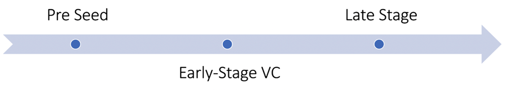
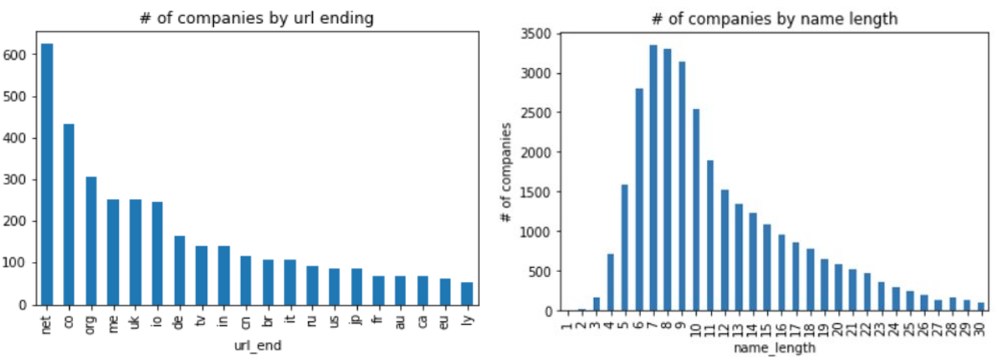
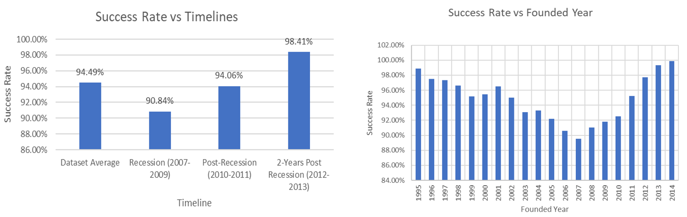
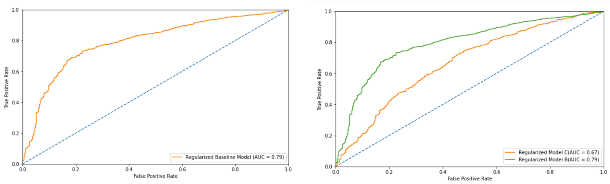

# Venture-Vision: Predicting Startup Success for Venture Capital

## Overview
**Venture-Vision** is a data-driven project that leverages machine learning to predict startup success, providing venture capitalists with actionable insights for optimizing portfolio decisions and managing investment risks. This project identifies key factors influencing startup growth, helping investors make informed, data-backed decisions.

## Business Use Case
In the competitive venture capital landscape, accurately identifying high-growth startups is essential. **Venture-Vision** enables investors to:
- Target high-potential sectors and funding stages.
- Utilize network effect insights for growth prediction.
- Leverage data insights to mitigate risk and maximize returns.

## Research Question
The main objective of this project is to answer: **What are the critical factors driving startup success, and how can venture capital firms use these insights for investment decisions?** This research identifies growth drivers to guide strategic investments and reduce portfolio risk.

## Data
The analysis uses a Crunchbase dataset with **49,439 startup records**, including:
- **Funding Stage**: Ranging from Pre-Seed to Late Stage.
- **Total Funding Amount**
- **Sector Information**
- **Founding Date**
- **Investor Network Details**

This dataset allowed a detailed examination of the attributes distinguishing successful startups, offering a historical view across various sectors and economic phases.

## Methodology

### 1. Exploratory Data Analysis (EDA)
   - **Funding Stage Analysis**: Figure 1 displays the distribution of startups across funding stages, offering insight into the startup lifecycle from Pre-Seed to Late Stage.
   - **URL and Name Insights**: Figure 3 shows (left) **URL endings** with `.net` as a popular domain outside `.com`, linked to over 600 startups and $5 billion in investment, and (right) **company name length**, with a right-skewed distribution around 8-9 characters.
   - **Economic Impact**: Figure 4 (left) presents success rates over time, revealing increased success rates post-recession, moving from 90.84% during the 2007-2009 recession to 98.41% two years post-recession.

### 2. Feature Engineering and Selection
   - Created features such as **average funding per stage**, **time since founding**, and **network strength** to capture key growth indicators.
   - Applied correlation analysis to select features with high predictive value, enhancing model effectiveness and interpretability.

### 3. Predictive Modeling
   - **Model Selection**: A **Random Forest classifier** was employed for its ability to handle high-dimensional data and capture complex non-linear relationships.
   - **Validation**: Cross-validation was used to confirm model reliability, achieving an **accuracy of 76%**.
   - **ROC Analysis**: Figure 5 shows ROC curves, illustrating the **True Positive Rate vs. False Positive Rate tradeoff**, with an AUC of 0.79 for the model, demonstrating its robustness in predicting startup success.

### 4. Investment Insights
   - **Sector-Specific Guidance**: Technology and healthcare startups showed higher success rates, guiding investment focus.
   - **Network Effect**: Strong investor networks correlated with higher success, underscoring the role of collaborative funding in growth.

## Key Findings
The project highlights **sector (especially technology and healthcare)**, **funding stage**, and **investor network strength** as primary indicators of startup success. Startups with early funding and robust networks exhibit higher growth potential, providing venture firms with a data-driven approach to targeted investment and risk management.

## Technical Stack
- **Programming Language**: Python
- **Libraries**: pandas, NumPy, scikit-learn, matplotlib, seaborn
- **Development Environment**: Jupyter Notebook

## Figures
1. **Funding Stage Distribution**:  - Overview of startup distribution across different funding stages.
2. **EDA Insights**:  - Company data by URL endings and name length, highlighting .net as a prominent domain outside .com.
3. **Success Rate by Timeline**:  - Success rate trends pre- and post-recession.
4. **ROC Curves**:  - True Positive Rate vs. False Positive Rate, illustrating model performance.

## Conclusion
**Venture-Vision** offers venture capitalists a robust framework for identifying high-growth startups. By combining predictive modeling with strategic insights, this project empowers investors to make informed decisions in a complex and dynamic market. It serves as an essential tool for venture capital firms, blending data science with financial insight to drive smarter investments.

---

This README provides a comprehensive, attractive presentation of the project for recruiters, blending technical rigor with business insights and using figures to support each section. Remember to update `path_to_FigureX.png` with the correct paths to your images in the repository. Let me know if you need further refinement!
